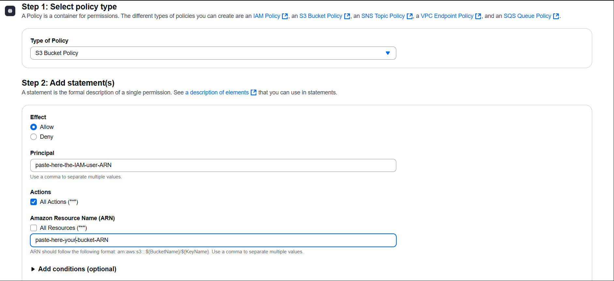

### 1. 🛠 Create an IAM User in AWS

- Go to [AWS IAM Console](https://console.aws.amazon.com/iam/)
- Create a user with **AWS S3 Full Access** 
- Attach the following policy


### ✅ 2. Create an S3 Bucket

- Go to the [AWS S3 Console](https://s3.console.aws.amazon.com)
- Click **Create bucket**
- Provide:
    - **Bucket name**: `your-unique-bucket-name`
    - **Region**: e.g., `Asia Pacific (Mumbai) - ap-south-1`
- Leave other settings as default and click **Create bucket**


### 🌐 3. Enable Static Website Hosting

- Go to your created bucket
- Click on the **Properties** tab
- Scroll to **Static website hosting** > Click **Edit**
- Enable `Static website hosting`
- Set:
   - **Index document**: `index.html`
   - **Error document**: `index.html` *(or `error.html` optionally)*
- Click **Save changes**


### 🔓 4. Allow Public Access

- In S3 bucket, Go to the **Permissions** tab
- Under **Block public access (bucket settings)**, click **Edit**
- **Uncheck all** options (especially "Block all public access")
- Confirm by checking the warning box
- Click **Save changes**


### 👥 5. Set Object Ownership to Public

- Still under the **Permissions** tab
- Scroll to **Object Ownership** and click **Edit**
- Choose:
   - `ACLs enabled`
   - `Bucket owner preferred`
- Save the changes


### 🛡 6. Attach Public Read Policy Using Policy Generator

#### 🧰 Use AWS Policy Generator:

- Open: [AWS Policy Generator](https://awspolicygen.s3.amazonaws.com/policygen.html)

**Fill in:**
- **Effect**: `Allow`
- **Principal**: *
- **Action**: `s3:GetObject` or check All action
- **ARN**:  paste-your-S3-Bucket-ARN




### 7. Create access-keys for IAM user


### 8. Go to GitHub Actions

- Open your GitHub repository.
- Click on the **"Actions"** tab.
- Click on **"Set up a workflow yourself"** or choose **"New workflow"**.


### 9. Create a Workflow File

- In the `.github/workflows/` folder, create a file named:  main.yml
- paste below code in the code area and click commit changes.

```bash
name: production testing pipeline

on:
  push:
    branches: [main]

jobs:
  deploy:
    name: Build, Test & Deploy Portfolio
    runs-on: ubuntu-latest

    steps:
    - name: Checkout code
      uses: actions/checkout@v3

    - name: Validate Files Exist
      run: |
        test -f Devops-CI-CD/Test_Code/index.html || (echo "index.html missing" && exit 1)
        test -f Devops-CI-CD/Test_Code/style.css || (echo "style.css missing" && exit 1)
        test -f Devops-CI-CD/Test_Code/script.js || (echo "script.js missing" && exit 1)

    - name: Configure AWS Credentials
      uses: aws-actions/configure-aws-credentials@v2
      with:
        aws-access-key-id: ${{ secrets.AWS_ACCESS_KEY_ID }}
        aws-secret-access-key: ${{ secrets.AWS_SECRET_ACCESS_KEY }}
        aws-region: 'ap-south-1'

    - name: Deploy to S3
      run: |
        aws s3 sync Devops-CI-CD/Test_Code/ s3://${{ secrets.AWS_S3_BUCKET_NAME }} --delete

```
 
### 10. Add New repository secrets

- Go to settings > secrets and variables
- click add new repository secret.
- click actions.


#### This will create a CI/CD pipeline from our github repository to the AWS S3 bucket via the IAM user with a desired set of security policies.
